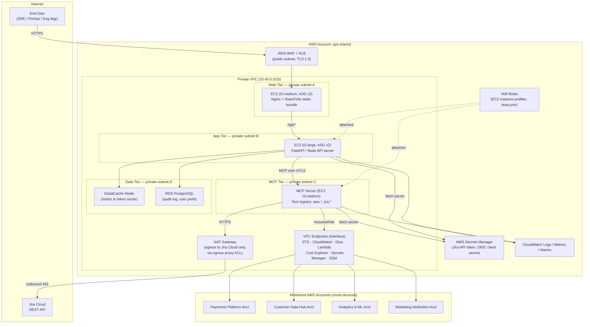
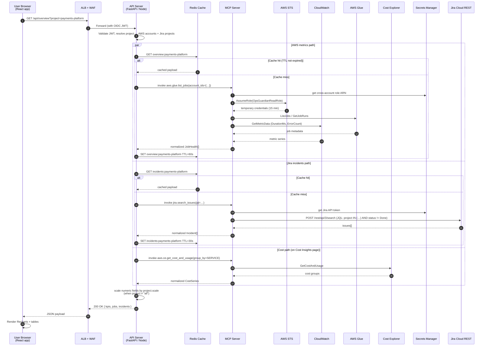

# OpsGuardian — Product Design Document

**Product:** OpsGuardian — Production Support & Cost Insights Dashboard for AWS ETL Pipelines
**Document Type:** Product Design Document (PDD)
**Audience:** Engineering team (frontend, backend, platform, SRE), QA, DevOps
**Author:** Solution Architecture
**Status:** Draft v1.0
**Last updated:** April 2026

---

## Table of Contents

1. [Executive Overview](#1-executive-overview)
2. [Need and Benefits](#2-need-and-benefits)
3. [Architecture Diagram](#3-architecture-diagram)
4. [Design Flow — AWS & Jira Integration and Metric Pipeline](#4-design-flow--aws--jira-integration-and-metric-pipeline)
5. [Low-Level Design (LLD)](#5-low-level-design-lld)
6. [Code Segmentation](#6-code-segmentation-monorepo-layout-and-module-contracts)
7. [Operational Considerations](#7-operational-considerations)
8. [Roadmap & Open Questions](#8-roadmap--open-questions)

---

## 1. Executive Overview

### 1.1 Purpose
OpsGuardian is a single-pane-of-glass production support dashboard that gives platform engineers, SRE leads, and finance partners a real-time, project-scoped view of the health, incidents, and cost of AWS-based ETL pipelines. It correlates **operational telemetry from AWS** (Glue, Lambda, Step Functions, CloudWatch, Cost Explorer) with **incident records from Jira** so that one team can answer the three questions that matter most during an outage or a monthly review:

1. *Is anything broken right now, and where?*
2. *Who is working on what, and what is the customer impact?*
3. *Are we within our cost envelope, and what is driving the variance?*

### 1.2 Pages and capabilities
The product is delivered as a **React + Vite single-page web application** with three primary surfaces, each filterable by **Project** (a logical grouping that maps to one or more AWS accounts and one or more Jira projects):

| Page | Purpose | Primary data sources |
|---|---|---|
| **Executive Overview** | At-a-glance health: total jobs, healthy vs. failed, active job table with run-level detail | AWS Glue, Lambda, Step Functions, CloudWatch |
| **Incident Center** | Live incident list, status donut, P1–P4 distribution, drill-down to Jira ticket | Jira REST API, AWS CloudWatch Alarms |
| **Cost Insights** | MTD spend, forecast, last-month comparison, budget consumption, per-service trend | AWS Cost Explorer, AWS Budgets |

### 1.3 In-scope vs. out-of-scope
**In scope (v1):** read-only dashboards, Project-scoped filtering, MCP-mediated AWS and Jira access, OIDC user login, audit logging.
**Out of scope (v1):** acknowledging incidents from the UI, write-back to Jira, in-app runbook execution, ML-driven anomaly detection (planned for v2).

### 1.4 Success metrics
- **Mean time to detect (MTTD)** for ETL failures reduced by ≥ 40 % vs. status-quo email/Slack alerts.
- **Mean time to acknowledge (MTTA)** Jira incident reduced by ≥ 30 % through unified visibility.
- **Cost overrun events** (project exceeds 90 % of monthly budget) detected ≥ 7 days earlier via forecast tile.
- **Dashboard adoption:** ≥ 80 % weekly active usage among on-call rotation within 60 days of launch.

---

## 2. Need and Benefits

### 2.1 Problem statement
Today, an ETL on-call engineer must context-switch across **five+ tools** during a single incident: the AWS console (Glue, Lambda, CloudWatch, Step Functions), Cost Explorer, Jira, Slack, and an internal runbook wiki. Each tool exposes a fragment of the truth, and none of them are scoped to *project* — they are scoped to *AWS account* or *Jira project*, which rarely match the way the business reasons about products. The result is delayed detection, slower response, and end-of-month cost surprises.

### 2.2 Target users
| Persona | Primary use | Frequency |
|---|---|---|
| **On-call engineer** | Triage failed runs, jump to Jira, see if cost-anomaly correlates | Daily |
| **SRE / Platform lead** | Weekly review of P1/P2 trends, hot pipelines, MTTR | Weekly |
| **Engineering manager** | Health snapshot before standup, project-level KPIs | Daily |
| **FinOps / Finance partner** | Monthly cost review, forecast vs. budget, per-service drilldown | Weekly–Monthly |

### 2.3 Benefits

| Benefit | Mechanism |
|---|---|
| **Faster incident triage** | Active jobs, alarms, and Jira tickets in one screen — no console hopping |
| **Project-aligned views** | Single dropdown collapses 5+ AWS accounts and 5+ Jira projects into business-friendly groupings (e.g., *Payments Platform*, *Customer Data Hub*) |
| **Predictable spend** | Side-by-side MTD vs. last-month-same-period vs. forecast vs. budget lets FinOps catch drift before month-end |
| **Reduced credential sprawl** | All AWS/Jira calls go through the **MCP server**, which holds the only long-lived credentials; the dashboard itself never sees raw keys |
| **Auditable access** | Every read is logged at the MCP layer with the requesting user and the project scope |
| **Read-only by design (v1)** | Eliminates risk of accidental destructive actions during outages |

### 2.4 Non-functional requirements
- **Performance:** P95 page load ≤ 2 s on cached data; ≤ 5 s on cold fetch.
- **Freshness:** AWS metrics ≤ 60 s stale; Jira incidents ≤ 30 s stale; cost data ≤ 6 h stale (Cost Explorer constraint).
- **Availability:** 99.5 % monthly for the dashboard plane.
- **Security:** OIDC SSO, short-lived JWT session tokens, all upstream calls server-side, secrets in AWS Secrets Manager, least-privilege IAM roles.
- **Observability:** structured JSON logs, OpenTelemetry traces, RED metrics on every API route.

---

## 3. Architecture Diagram

OpsGuardian is deployed entirely inside a **private VPC** on AWS. Public traffic enters only through an **Application Load Balancer** terminated at AWS WAF; everything behind it runs in private subnets. The **MCP (Model Context Protocol) server** is the single egress point for all third-party reads — both AWS service APIs and Jira Cloud — and the only component holding privileged credentials.



### 3.1 Key architecture decisions

| # | Decision | Rationale |
|---|---|---|
| AD-01 | **Deploy in a private VPC, expose only via ALB + WAF** | Reduces blast radius; no service has a public IP |
| AD-02 | **Separate Web, App, MCP tiers in distinct subnets** | Defense in depth; MCP can be reached only from App tier SG |
| AD-03 | **MCP server is the sole egress path to AWS APIs and Jira** | Single audit point; credential isolation; uniform tool contract |
| AD-04 | **Use VPC Interface Endpoints for AWS services** | Traffic to Glue/Lambda/CE never leaves AWS backbone |
| AD-05 | **NAT Gateway used only for Jira Cloud** | Restricted via egress proxy allow-list to `*.atlassian.net` |
| AD-06 | **Cross-account access via `sts:AssumeRole`** | Each monitored account has a read-only `OpsGuardianReadRole`; central MCP assumes per request |
| AD-07 | **Redis caches AWS responses (60–300 s TTL)** | Dampens Cost Explorer/CloudWatch quota usage and improves P95 |
| AD-08 | **PostgreSQL for audit and user prefs only** | No business data stored; simplifies compliance |

### 3.2 MCP server — what it is and why
The **MCP (Model Context Protocol) server** is a thin, language-agnostic gateway that exposes upstream systems (AWS, Jira) as a uniform set of **named tools** with typed inputs and outputs. The API server invokes tools by name (e.g., `aws.glue.list_jobs`, `jira.search_issues`) over an mTLS-authenticated RPC channel. Benefits:

- The dashboard's API server holds **no AWS or Jira credentials** — only the MCP service principal does.
- New upstream systems (PagerDuty, Datadog, etc.) become a *new tool*, not a new credential and code path in the API.
- Tool calls are uniformly logged, rate-limited, and cached at one place.
- The same MCP server can be reused by other internal apps and AI agents without re-implementing connectors.

---

## 4. Design Flow — AWS & Jira Integration and Metric Pipeline

This section traces an end-to-end request from the moment a user lands on a page to the moment data renders on screen, including how the system reaches both AWS and Jira through MCP tools.



### 4.1 Project → AWS account / Jira project mapping
The `Project` concept in the UI is a server-side mapping resolved by the API at request time. It is held in PostgreSQL (`project_mappings` table) and reloaded into memory on a 5-minute cache:

```sql
project_mappings
  project_id        text PRIMARY KEY     -- e.g. 'payments-platform'
  display_name      text                 -- 'Payments Platform'
  aws_account_ids   text[]               -- ['957382641029', '203847561234']
  jira_project_keys text[]               -- ['PAY', 'PAYOPS']
  scale_factor      numeric              -- used only for synthetic/demo mode
  cost_center       text
```

When the user picks **All Projects**, the API fans out to every entry; when they pick one, it filters to just that row.

### 4.2 Caching, throttling, and freshness
- **Redis keys** are namespaced by `{resource}:{project_id}:{window}`.
- **TTLs**: Glue/Lambda metrics 60 s, Jira issues 30 s, Cost Explorer 6 h.
- **Stale-while-revalidate**: on cache miss but within "soft" TTL we return stale and refresh in background (BullMQ / RQ worker).
- **Throttling**: per-tool token bucket on the MCP server prevents downstream throttling (CE has a hard 5 req/s limit per account).

### 4.3 Authentication & authorization flow
1. User hits ALB → redirected to OIDC IdP (Okta / AWS Cognito).
2. After sign-in, frontend stores short-lived (15 min) JWT in HttpOnly cookie.
3. Every `/api/*` call carries the JWT; API server verifies signature, expiry, and `groups` claim.
4. API server passes a **scoped service token** (NOT the user JWT) to MCP, with the user's id and group as claims for audit.
5. MCP enforces a per-tool ACL (e.g., only `finops` group may call `aws.ce.*`).

---

## 5. Low-Level Design (LLD)

### 5.1 Component inventory

| # | Component | Tech | Responsibility |
|---|---|---|---|
| C1 | **Web Frontend** | React 18, Vite, TypeScript, TanStack Query, Recharts, shadcn/ui, Tailwind, wouter | Renders 3 pages, holds Project/Environment context, talks only to `/api/*` |
| C2 | **API Server** | Node 20 + Express (or Python 3.12 + FastAPI) | Auth, project resolution, MCP orchestration, response shaping, caching |
| C3 | **MCP Server** | Python 3.12, MCP SDK | Tool registry for AWS + Jira; credential broker; egress audit |
| C4 | **Auth Proxy** | OIDC (Okta / Cognito) | SSO, JWT issuance |
| C5 | **Redis Cache** | ElastiCache Redis 7 | Metric & token caching |
| C6 | **PostgreSQL** | RDS Postgres 15 | Project mappings, audit log, user prefs |
| C7 | **Cross-account IAM Role** | `OpsGuardianReadRole` | Read-only Glue / Lambda / CW / CE / SSM in each monitored account |
| C8 | **Background Worker** | BullMQ (Node) / RQ (Python) | Cache warmers, scheduled cost rollups |
| C9 | **CloudWatch Alarms** | AWS CloudWatch | Self-monitoring of API latency, MCP errors |

---

### 5.2 Frontend (C1)

#### 5.2.1 Page structure
```
/                      → Executive Overview (default)
/incidents             → Incident Center
/costs                 → Cost Insights
```
A `DashboardLayout` wraps every page and provides the sidebar, the **Projects** top row (centered), and the **Environment** header.

#### 5.2.2 React contexts
| Context | File | Provides |
|---|---|---|
| `AccountContext` | `src/contexts/AccountContext.tsx` | `{ account, setAccountId, accounts }` — currently selected Project, available list, change handler |
| `EnvironmentContext` *(planned)* | `src/contexts/EnvironmentContext.tsx` | `prod` / `staging` / `dev` toggle |

The Project value is propagated to every API call as a query string `?project={id}`. On change, TanStack Query invalidates dependent keys.

#### 5.2.3 Data-fetching pattern
- All HTTP is via **generated API client** from `@workspace/api-client-react` (OpenAPI codegen).
- Each page uses **one parent `useQuery` per logical resource** (e.g., `useGetOverview`, `useGetIncidents`, `useGetCostKpis`, `useGetCostServiceTrend`).
- Loading state: skeleton tiles + Tremor-style placeholders.
- Errors: bordered red Alert + retry button; never show empty data silently.

#### 5.2.4 Component breakdown (Executive Overview)
```
ExecutiveOverviewPage
├── KpiTileGrid
│   ├── KpiTile (Total Jobs)
│   ├── KpiTile (Healthy Jobs)
│   └── KpiTile (Failed Jobs)
├── ActiveJobsTable
│   ├── TableHeader (sticky)
│   └── ActiveJobRow ×N        ← inline-expandable; on expand calls useGetJobRuns(id)
└── PipelineRunsModal           ← lazy-loaded
```

#### 5.2.5 Component breakdown (Incident Center)
```
IncidentCenterPage
├── IncidentKpiRow             ← P1–P4 counts
├── ChartsRow
│   ├── StatusDonut            ← Recharts PieChart
│   └── PriorityBar            ← Recharts BarChart
└── ActiveIncidentsTable
    └── IncidentRow ×N         ← clickable → opens Jira deep-link in new tab
```

#### 5.2.6 Component breakdown (Cost Insights)
```
CostInsightsPage
├── CostKpiRow (5 tiles)
│   ├── KpiTile (MTD)
│   ├── KpiTile (Last Month — Same Period)
│   ├── KpiTile (Forecast EOM)
│   ├── KpiTile (Last Month Total)
│   └── KpiTile (Budget Consumed %)
└── CostPerServiceChart
    ├── ServiceFilter (Glue / Lambda / All)
    ├── WindowSelect (7d / 30d / 60d)
    └── Recharts LineChart
```

#### 5.2.7 Project scaling on the client (demo mode)
While the dashboard is in **demo / synthetic mode**, the API returns full-scale numbers and the client multiplies them by `account.scale`. Once C7 cross-account IAM is provisioned, the API will return the real per-project numbers and the client multiplier becomes a no-op (`scale = 1`).

---

### 5.3 API Server (C2)

#### 5.3.1 Routes
| Method | Path | Returns | Backed by MCP tools |
|---|---|---|---|
| GET | `/api/overview` | `{ kpis, jobs[] }` | `aws.glue.list_jobs`, `aws.glue.get_job_runs`, `aws.cw.get_metric_data` |
| GET | `/api/incidents` | `{ kpis, statusCounts, incidents[] }` | `jira.search_issues` |
| GET | `/api/costs/kpis` | `{ mtd, lastMonthSamePeriod, forecast, lastMonthTotal, budgetPct }` | `aws.ce.get_cost_and_usage`, `aws.ce.get_forecast`, `aws.budgets.describe_budgets` |
| GET | `/api/costs/service-trend?service=glue&window=30d` | `{ points[] }` | `aws.ce.get_cost_and_usage` |
| GET | `/api/projects` | `Project[]` | reads from RDS `project_mappings` |
| GET | `/api/healthz` | `{ ok: true }` | — |

All routes accept `?project={id}`; when omitted defaults to `all`.

#### 5.3.2 Request lifecycle
1. **Auth middleware** — verifies JWT, attaches `req.user`.
2. **Project resolver** — looks up `project_mappings`, attaches `req.scope = { aws_account_ids, jira_project_keys }`.
3. **Cache lookup** — Redis GET with composite key.
4. **MCP fan-out** — `Promise.all` (or `asyncio.gather`) of tool invocations.
5. **Normalizer** — collapses upstream shapes into stable response DTOs.
6. **Cache write + respond** — TTL per resource type.

#### 5.3.3 Response DTOs (TypeScript)
```ts
// Stable shapes the frontend consumes; API is the only place the upstream shape leaks in.
export interface OverviewResponse {
  kpis: { totalJobs: number; healthyJobs: number; failedJobs: number; successRatePct: number };
  jobs: Array<{
    jobId: string; jobName: string; status: 'Running'|'Success'|'Failed'|'Delayed';
    startTime: string; endTime: string | null; durationSec: number; costUsd: number;
  }>;
}

export interface IncidentsResponse {
  kpis: { p1: number; p2: number; p3: number; p4: number };
  statusCounts: Array<{ status: string; count: number }>;
  incidents: Array<{
    key: string; summary: string; priority: 'P1'|'P2'|'P3'|'P4';
    status: string; assignee: string | null; createdAt: string; jiraUrl: string;
  }>;
}

export interface CostKpisResponse {
  mtdUsd: number; lastMonthSamePeriodUsd: number; forecastEomUsd: number;
  lastMonthTotalUsd: number; budgetUsd: number; budgetConsumedPct: number;
}
```

---

### 5.4 MCP Server (C3)

The MCP server registers tools in two namespaces: `aws.*` and `jira.*`. Each tool has a JSON Schema input, a typed output, and a handler.

#### 5.4.1 Tool registry (illustrative)
| Tool | Input | Output | Underlying call |
|---|---|---|---|
| `aws.glue.list_jobs` | `{ account_ids: string[] }` | `JobMeta[]` | `glue:GetJobs` |
| `aws.glue.get_job_runs` | `{ account_id, job_name, max_results }` | `JobRun[]` | `glue:GetJobRuns` |
| `aws.lambda.list_functions` | `{ account_ids }` | `LambdaMeta[]` | `lambda:ListFunctions` |
| `aws.cw.get_metric_data` | `{ account_id, queries }` | `MetricSeries[]` | `cloudwatch:GetMetricData` |
| `aws.ce.get_cost_and_usage` | `{ account_ids, start, end, granularity, group_by }` | `CostGroup[]` | `ce:GetCostAndUsage` |
| `aws.ce.get_forecast` | `{ account_ids, end, metric }` | `ForecastResult` | `ce:GetCostForecast` |
| `aws.budgets.describe_budgets` | `{ account_id }` | `Budget[]` | `budgets:DescribeBudgets` |
| `jira.search_issues` | `{ jql, fields, max }` | `Issue[]` | `POST /rest/api/3/search` |
| `jira.get_issue` | `{ key }` | `Issue` | `GET /rest/api/3/issue/{key}` |

#### 5.4.2 Credential brokerage
- On boot, MCP loads its own IAM instance-profile credentials.
- For each AWS call it performs `sts:AssumeRole` against the target account's `OpsGuardianReadRole` and caches the temporary credentials for 14 minutes (refresh at 12 min).
- For Jira it fetches the API token from Secrets Manager once per process and rotates on a 24-h timer.

#### 5.4.3 Per-tool middleware (in order)
1. **AuthN** — verify mTLS client cert == API server.
2. **AuthZ** — check `tool_acl[tool_name]` against caller group claims.
3. **Schema validate** — JSON Schema input.
4. **Rate limit** — token bucket per `{tool, account_id}`.
5. **Handler** — performs upstream call.
6. **Audit log** — writes JSON line: `{ts, user, tool, account_id, latency_ms, status, bytes}`.

---

### 5.5 Database schema (C6 — RDS Postgres)
```sql
-- Project taxonomy
CREATE TABLE project_mappings (
  project_id        TEXT PRIMARY KEY,
  display_name      TEXT NOT NULL,
  aws_account_ids   TEXT[] NOT NULL,
  jira_project_keys TEXT[] NOT NULL,
  cost_center       TEXT,
  scale_factor      NUMERIC DEFAULT 1.0,   -- demo only
  created_at        TIMESTAMPTZ DEFAULT now()
);

-- Audit log (also mirrored to CloudWatch)
CREATE TABLE access_audit (
  id            BIGSERIAL PRIMARY KEY,
  ts            TIMESTAMPTZ DEFAULT now(),
  user_email    TEXT NOT NULL,
  user_groups   TEXT[],
  route         TEXT NOT NULL,
  project_id    TEXT,
  tool_calls    JSONB,
  latency_ms    INT,
  status_code   INT
);

-- User preferences
CREATE TABLE user_prefs (
  user_email     TEXT PRIMARY KEY,
  default_project TEXT REFERENCES project_mappings(project_id),
  theme           TEXT DEFAULT 'light',
  updated_at      TIMESTAMPTZ DEFAULT now()
);
```

### 5.6 Caching keys (C5)
```
overview:{project_id}                      → 60 s
incidents:{project_id}                     → 30 s
costs:kpis:{project_id}:{yyyy-mm}          → 6 h
costs:service-trend:{project_id}:{svc}:{w} → 6 h
projects:list                              → 5 min
sts:{account_id}                           → 14 min
```

### 5.7 Error handling matrix
| Failure | API behaviour | UI behaviour |
|---|---|---|
| MCP unreachable | 503 + `Retry-After: 30` | Red alert, retry button |
| One AWS account fails (others ok) | 200 with `partial: true` and per-account error list | Warning banner, partial data shown |
| Jira 401 (token expired) | 502, alarm fires | Alert + link to ops runbook |
| Cache stale and upstream slow | Return stale with `X-Stale: true` | Subtle "data may be up to N min old" pill |

---

## 6. Code Segmentation (Monorepo Layout and Module Contracts)

OpsGuardian lives in a **pnpm monorepo** with TypeScript project references for build-time isolation. Python services follow the same boundary principle but as separate Poetry projects.

### 6.1 Top-level layout
```
opsguardian/
├── pnpm-workspace.yaml
├── tsconfig.base.json
├── docs/                                 # this PDD + ADRs
├── infra/                                # IaC (Terraform)
│   ├── network/                          # VPC, subnets, ALB, WAF
│   ├── compute/                          # ASGs, launch templates
│   ├── data/                             # RDS, ElastiCache
│   └── iam/                              # cross-account roles, instance profiles
├── packages/                             # shared TS libs
│   ├── api-spec/                         # OpenAPI YAML (single source of truth)
│   ├── api-client-react/                 # codegen TanStack Query hooks (consumed by web)
│   └── ui-kit/                           # shadcn-derived shared components
└── artifacts/                            # deployable units
    ├── etl-dashboard/                    # React + Vite frontend (C1)
    ├── api-server/                       # Node/Express API (C2)
    ├── mcp-server/                       # Python MCP server (C3)
    └── worker/                           # Background worker (C8)
```

### 6.2 Frontend module breakdown — `artifacts/etl-dashboard/`
```
src/
├── main.tsx                              # bootstrap + Router
├── App.tsx                               # providers: QueryClient, AccountProvider, Router
├── contexts/
│   └── AccountContext.tsx                # Project (selected) state
├── components/
│   ├── layout/
│   │   └── DashboardLayout.tsx           # sidebar + Projects top row + Environment header
│   ├── ui/                               # shadcn primitives (Button, Select, Table…)
│   ├── kpi/
│   │   ├── KpiTile.tsx
│   │   └── KpiTileGrid.tsx
│   ├── tables/
│   │   ├── ActiveJobsTable.tsx
│   │   └── ActiveIncidentsTable.tsx
│   └── charts/
│       ├── StatusDonut.tsx
│       ├── PriorityBar.tsx
│       └── CostPerServiceChart.tsx
├── pages/
│   ├── executive-overview.tsx
│   ├── incidents.tsx
│   └── costs.tsx
├── hooks/                                # composed query hooks (call generated client)
│   ├── useOverview.ts
│   ├── useIncidents.ts
│   └── useCosts.ts
├── lib/
│   ├── format.ts                         # currency / duration / date helpers
│   └── apiClient.ts                      # axios instance (baseURL = import.meta.env.BASE_URL)
└── styles/
    └── tailwind.css
```

**Naming and boundary rules**
- Pages **never** call `fetch` directly — only `hooks/*`.
- Hooks **never** call `axios` directly — only the generated client from `@workspace/api-client-react`.
- Components in `components/ui/` are presentation-only and accept no domain types.
- Tailwind classes only — no styled-components, no CSS modules.

### 6.3 API server module breakdown — `artifacts/api-server/`
```
src/
├── index.ts                              # express bootstrap, listens on $PORT
├── config.ts                             # env parsing (zod)
├── auth/
│   ├── jwtMiddleware.ts                  # verifies OIDC JWT
│   └── projectResolver.ts                # attaches req.scope
├── routes/
│   ├── overview.ts
│   ├── incidents.ts
│   ├── costs.ts                          # /api/costs/kpis + /api/costs/service-trend
│   └── projects.ts
├── services/
│   ├── mcpClient.ts                      # mTLS RPC client; one per upstream
│   ├── overviewService.ts                # orchestrates Glue + Lambda + CW tool calls
│   ├── incidentService.ts                # orchestrates jira.search_issues
│   ├── costService.ts                    # orchestrates ce + budgets
│   └── normalizer/                       # upstream → DTO conversion (pure fns)
├── cache/
│   └── redisClient.ts                    # ioredis with JSON helpers
├── audit/
│   └── auditLogger.ts                    # writes to RDS + CloudWatch
└── types/
    └── dtos.ts                           # OverviewResponse, IncidentsResponse, …
```

### 6.4 MCP server module breakdown — `artifacts/mcp-server/`
```
opsguardian_mcp/
├── __main__.py                           # entrypoint
├── server.py                             # MCP framework wiring
├── auth/
│   ├── mtls.py                           # client-cert verification
│   └── acl.py                            # tool-level ACLs
├── credentials/
│   ├── sts_broker.py                     # AssumeRole + cache
│   └── secrets.py                        # Secrets Manager wrapper
├── tools/
│   ├── aws/
│   │   ├── glue.py                       # list_jobs, get_job_runs
│   │   ├── lambda_.py                    # list_functions, get_metrics
│   │   ├── cloudwatch.py                 # get_metric_data
│   │   ├── cost_explorer.py              # get_cost_and_usage, get_forecast
│   │   └── budgets.py                    # describe_budgets
│   └── jira/
│       ├── client.py                     # httpx session, retries, pagination
│       ├── search.py                     # search_issues
│       └── issue.py                      # get_issue
├── middleware/
│   ├── ratelimit.py                      # token bucket per (tool, account)
│   └── audit.py                          # JSON-line logging
└── schemas/
    ├── glue.py                           # pydantic models
    ├── jira.py
    └── cost.py
```

### 6.5 Shared API contract — `packages/api-spec/`
```
openapi.yaml                              # single source of truth
scripts/
  └── codegen.ts                          # emits packages/api-client-react/src/generated/*
```
The frontend `useOverview()` hook is a thin wrapper around the generated `useGetOverview()` so that any contract change is **type-checked at compile time** in the React app. CI fails the build if `openapi.yaml` and the API server's actual response shapes diverge (verified by contract tests in `artifacts/api-server/test/contract.spec.ts`).

### 6.6 Build & deploy pipeline
```
GitHub PR
  → CI: pnpm -r lint / typecheck / test, poetry test for mcp-server
  → CI: build all artifacts, push images to ECR
  → CD (main): Terraform plan
  → CD (manual approval) : Terraform apply + ASG instance refresh
```

### 6.7 Coding standards
- **TypeScript:** `"strict": true`, no `any` without an `// eslint-disable` justification, ESLint + Prettier.
- **Python:** Ruff + Black, mypy `--strict`, every public function has a docstring.
- **Commits:** Conventional Commits (`feat:`, `fix:`, `chore:` …).
- **Tests:** ≥ 70 % line coverage on services and tools; React Testing Library + Playwright e2e.
- **No emojis** in UI strings or code identifiers (per brand guideline).

---

## 7. Operational Considerations

### 7.1 Observability
- **Logs**: JSON to stdout → CloudWatch Logs → OpenSearch (30-day retention).
- **Metrics**: RED on every API route; per-tool latency / error rate on MCP.
- **Traces**: OpenTelemetry, AWS X-Ray exporter.
- **Dashboards**: CloudWatch dashboard "OpsGuardian-self" (P95, error %, cache hit %, MCP tool latency).

### 7.2 Alerting
| Alarm | Threshold | Action |
|---|---|---|
| API 5xx rate | > 1 % over 5 min | PagerDuty P3 |
| MCP tool error rate | > 5 % over 5 min | PagerDuty P2 |
| Cache hit rate | < 50 % over 30 min | Slack warning |
| Jira 4xx burst | > 10 in 5 min | PagerDuty P3 |

### 7.3 DR / backup
- RDS automated snapshots, 7-day retention, cross-region copy nightly.
- ElastiCache is treated as ephemeral (no backup).
- IaC in Git is the source of truth; full recreate ≤ 60 minutes.

### 7.4 Security
- All secrets in AWS Secrets Manager; **never** in env files in Git.
- Quarterly IAM access review; cross-account role `ExternalId` rotated yearly.
- Pen test before GA.

---

## 8. Roadmap & Open Questions

### 8.1 Roadmap

| Version | Theme | Highlights |
|---|---|---|
| **v1.0** | Read-only dashboard | 3 pages, project filtering, MCP-mediated reads |
| **v1.1** | Notifications | Slack digest of P1 incidents per project |
| **v2.0** | Write actions | Acknowledge incident, add Jira comment, restart Glue job (with approval workflow) |
| **v2.1** | Anomaly detection | Cost-spend ML forecast, run-time z-score outlier flagging |
| **v3.0** | Multi-cloud | GCP / Azure connectors as new MCP tool namespaces |

### 8.2 Open questions (require product / security decision)
1. Should the `Environment` toggle (prod / staging / dev) drive a **different MCP cluster** or a **filter inside the same MCP**?
2. For Jira, do we standardize on **JQL templates per project** managed in `project_mappings`, or expose a free-form JQL field to power users?
3. Is **Cognito** acceptable as the OIDC provider, or must we use the corporate Okta tenant?
4. Cost Explorer has a $0.01-per-request charge — confirm the cache TTL of 6 h satisfies finance accuracy expectations.

---

*End of document. Reviewers: please add comments inline as suggestions; structural changes via PR against `docs/OpsGuardian-Product-Design-Document.md`.*
